# ANotesClient
Client for ANotes (Task Manager &amp; Knowledge Base)

Менеджер задач, в котором ИИ-агент — полноправный клиент API, а не кнопка «сделать красиво».

Подключаете Claude, Cursor или любого другого агента по OpenAPI-схеме, и он читает задачи, пишет резюме, оставляет комментарии и меняет статусы. Каждое его действие помечено в интерфейсе: видно, что сделал агент, и видно, кто его об этом попросил.

<!-- TODO: положить demo.gif в docs/ и раскомментировать -->
<!--  -->

> **Статус:** работает локально, в продакшене не разворачивался. Подробности — в разделе [Состояние проекта](#состояние-проекта).

## Скриншоты

### Задачи

<details>
  <summary>Список задач</summary>
  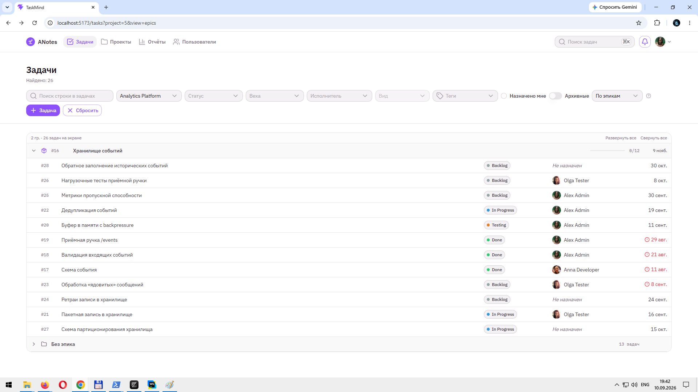
</details>

<details>
  <summary>Список задач — группировка по эпикам</summary>
  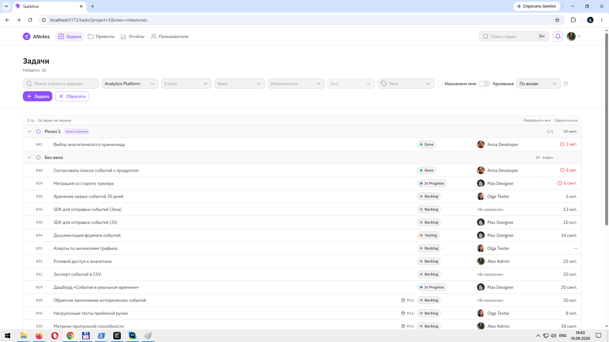
</details>

<details>
  <summary>Список задач — группировка по вехам</summary>
  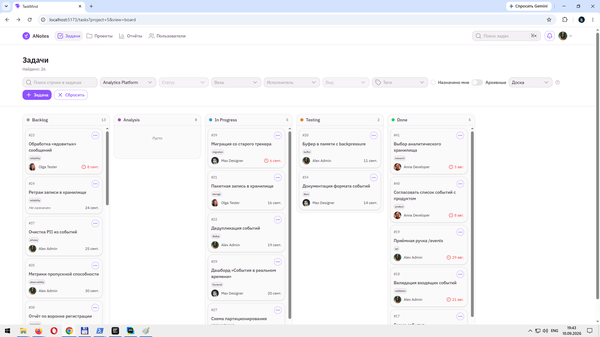
</details>

<details>
  <summary>Список задач — доска по статусам</summary>
  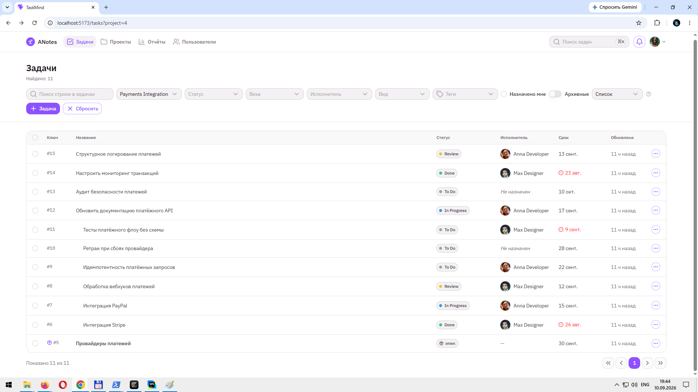
</details>

<details>
  <summary>Список задач — фильтры</summary>
  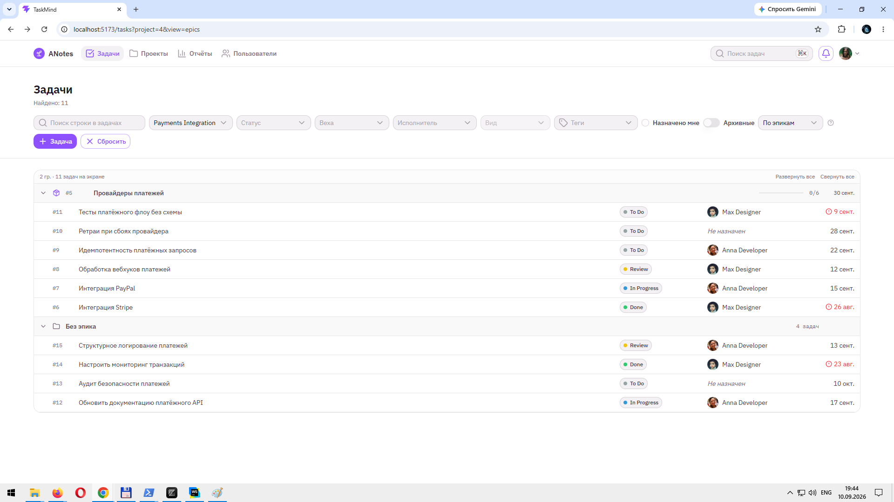
</details>

<details>
  <summary>Страница задачи</summary>
  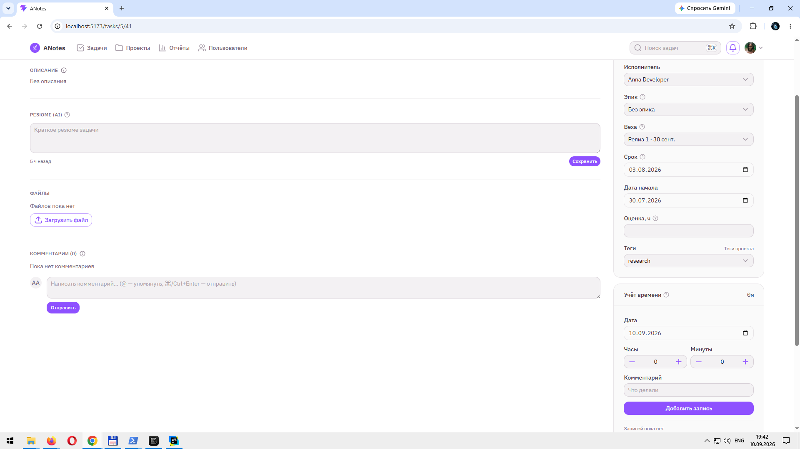
</details>

<details>
  <summary>Назначить задачу на себя</summary>
  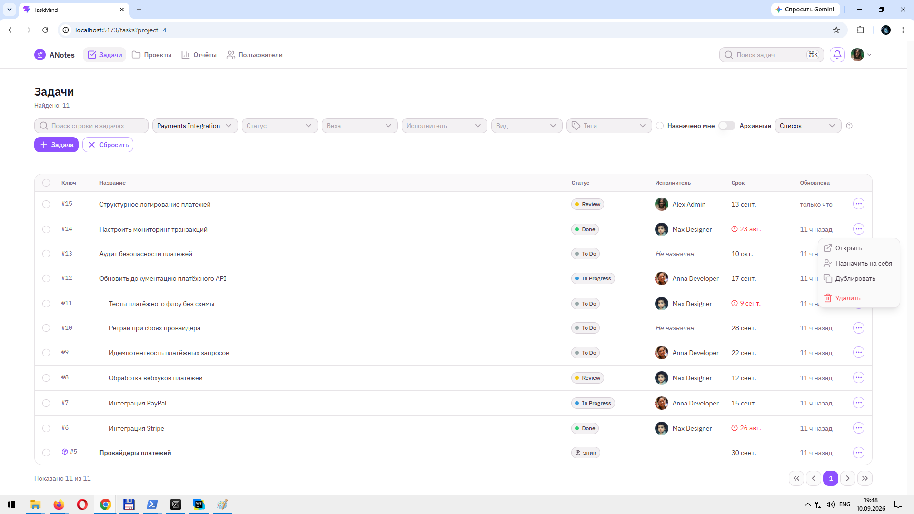
</details>

### Проекты и планирование

<details>
  <summary>Проекты</summary>
  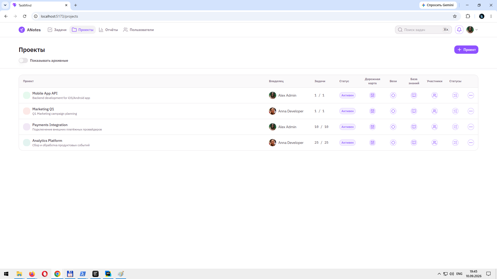
</details>

<details>
  <summary>Дорожная карта эпиков</summary>
  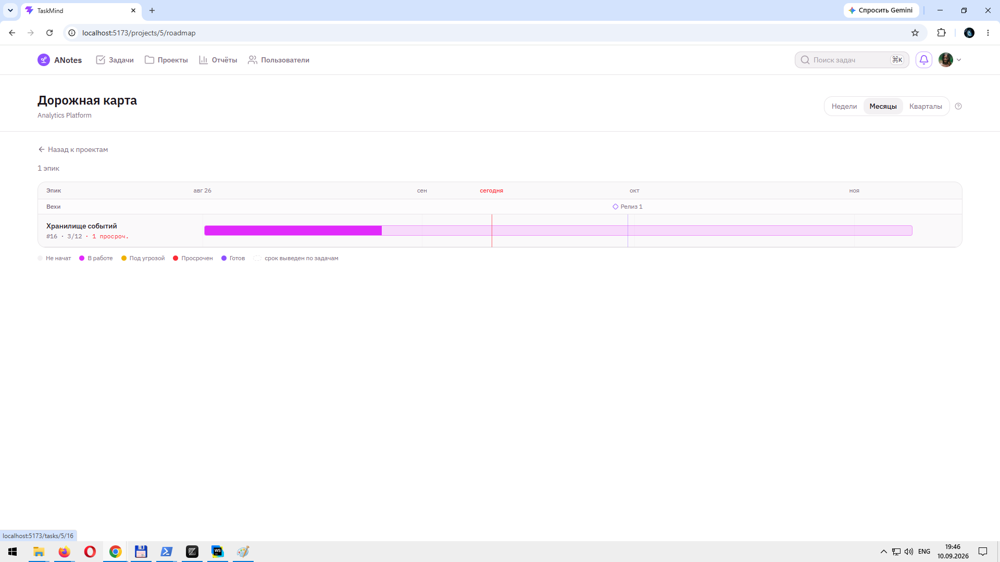
</details>

<details>
  <summary>Дорожная карта — масштаб и вехи</summary>
  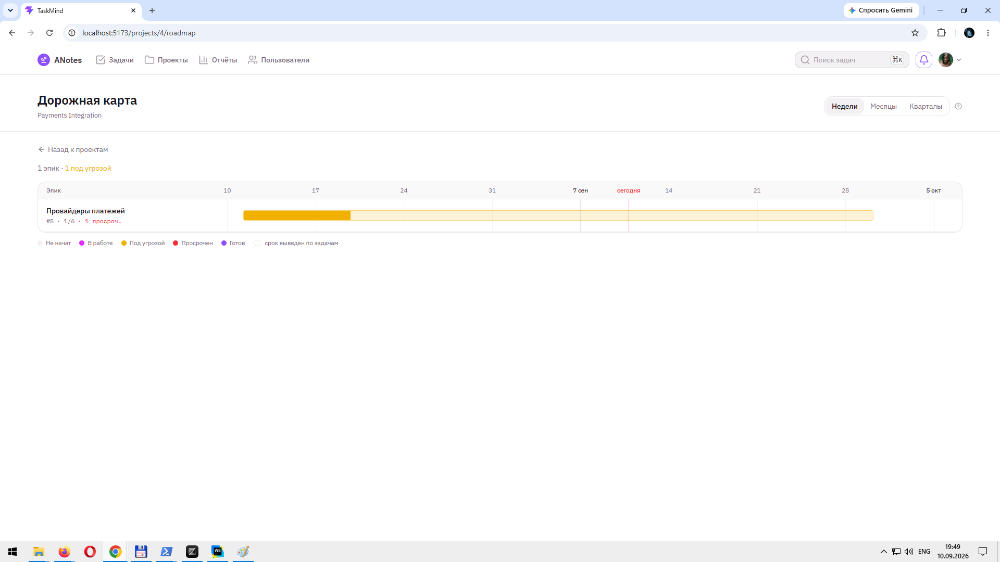
</details>

<details>
  <summary>Вехи</summary>
  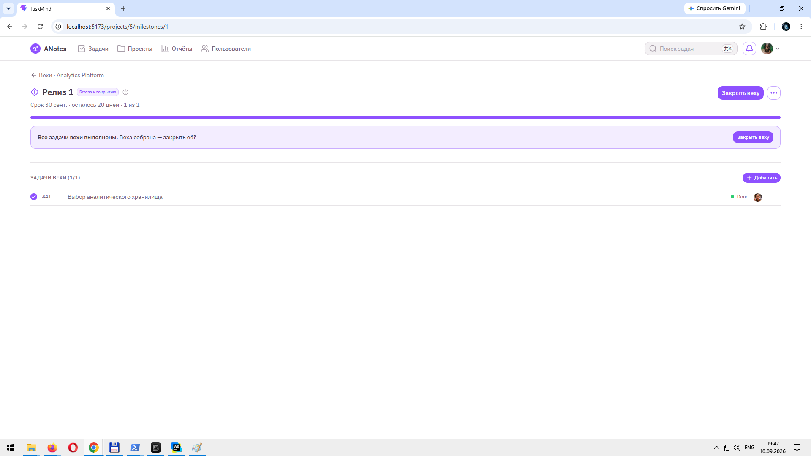
</details>

### Прочее

<details>
  <summary>Отчёты по времени</summary>
  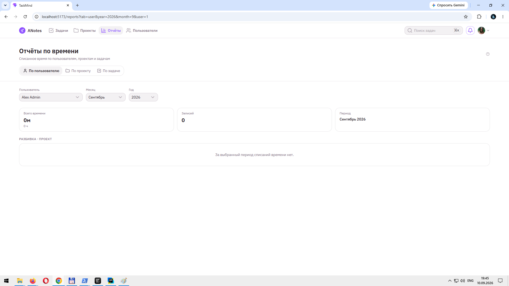
</details>

<details>
  <summary>База знаний</summary>
  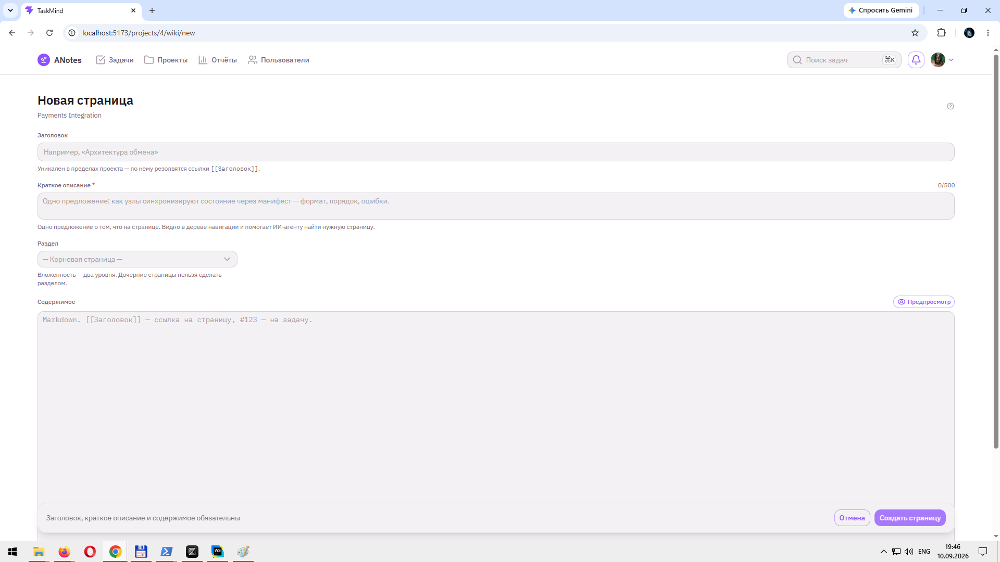
</details>

<details>
  <summary>Пользователи</summary>
  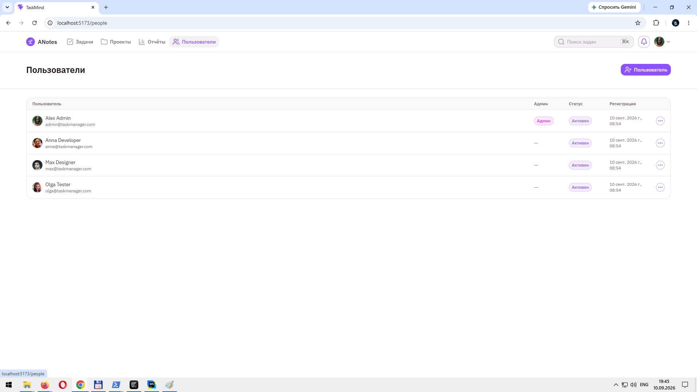
</details>

<details>
  <summary>Справка</summary>
  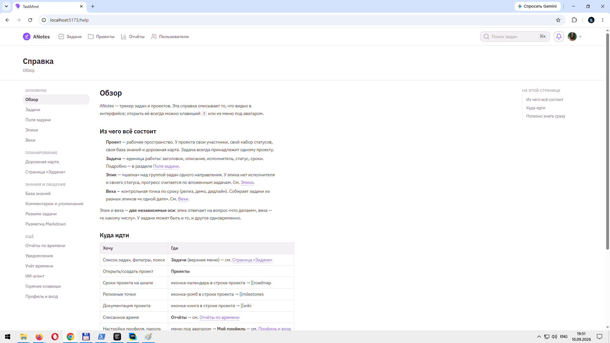
</details>

---

## Чем отличается

**ИИ-агент вне бэкенда.** Внутри сервера нет ни LangChain4j, ни промптов, ни привязки к конкретной модели. Агент подключается снаружи по урезанной OpenAPI-схеме с отдельным токеном. Меняете модель — сервер об этом не знает.

**Видно, кто действовал.** Комментарии и записи активности несут `actorType` — `HUMAN` или `AGENT`. Автором остаётся человек: агент лишь инструмент, но рядом с записью стоит бейдж «через агента», и весь его вклад можно скрыть одним переключателем.

**Агент не удаляет.** Токен агента выдаётся на того же пользователя, но без прав администратора, и разрушительные действия ему недоступны. Вики он читает, но не правит.

**Эпик — вид сущности, а не «задача с детьми».** У эпика нет исполнителя, своего статуса и списания времени. Это контейнер, а не работа. Поэтому не бывает деревьев в четыре уровня, циклов и споров о том, что считать родителем.

**Статусы настраиваются под проект.** Свой набор, свои цвета, свой порядок, флаги «стартовый» и «закрывающий». Прогресс эпиков и вех считается по этим флагам, а не по названиям.

---

## Быстрый старт

Нужен запущенный бэкенд на `localhost:8080` <!-- TODO: ссылка на репозиторий бэкенда -->.

**Node** `^20.19.0 || >=22.12.0` — требование Vite 8 и Nuxt UI 4, зафиксировано в `engines`.

```bash
npm install
npm run dev
```

Дев-сервер проксирует `/api` на `http://localhost:8080` — см. `vite.config.ts`.

### Скрипты

| Команда | Что делает |
|---|---|
| `npm run dev` | дев-сервер с горячей перезагрузкой |
| `npm run build` | сборка: `vite build`, затем `vue-tsc -b` |
| `npm run type-check` | только проверка типов |
| `npm run preview` | предпросмотр собранного `dist` |

---

## Подключение ИИ-агента

Раздел `/agent` в приложении собирает всё нужное в одном месте.

1. Нажать **«Создать токен»** — второй JWT на вашего же пользователя: группы `USER` + `AGENT`, без `ADMIN`, срок 48 часов.
2. Нажать **«Скопировать всё»** — в буфер попадает markdown с токеном, адресами, системным промптом и правилами.
3. Вставить в настройки вашего ИИ-клиента.

Дальше можно просто просить:

```
Посмотри задачу 42 и обнови резюме
Переведи задачу 42 в «Готово»
Что у меня в работе по проекту «Веб-клиент»?
Спиши полтора часа на задачу 108 с комментарием «код-ревью»
```

**Что агент может:** читать задачи, проекты, комментарии и вики; писать резюме; оставлять комментарии; менять статусы, исполнителей и сроки; списывать время.

**Что не может:** удалять что бы то ни было, править вики, управлять пользователями и правами, читать конфигурацию сервера.

Схема для агента — `/api/agent/openapi.json`: урезанный набор операций вместо полного API, чтобы модель не путалась и не тратила контекст.

> **Важно про токен.** Отзыва на сервере нет. Кнопка «Удалить» забывает токен только локально; сам токен продолжает действовать до истечения 48 часов. Смена пароля его не отменяет. Обращайтесь с ним как с паролем.

---

## Возможности

**Задачи и эпики**
Иерархия в один уровень через вид сущности. Прогресс эпика считает сервер по закрывающим статусам дочерних задач.

**Четыре режима списка задач**
Плоский список, группировка по эпикам, группировка по вехам и доска по статусам. Колонки доски — статусы проекта в своём порядке; карточки перетаскиваются между ними мышью, оптимистично, с откатом при конфликте версий. Группы сворачиваются, состояние живёт в адресе — ссылкой на конкретный вид можно поделиться.

**Вехи**
Ось, ортогональная эпикам: эпик отвечает «что делаем», веха — «к какому числу». Собирает задачи из разных направлений. Состояния от «Запланирована» до «Готова к закрытию»; закрытие с недоделками разрешено, но фиксируется.

**Дорожная карта**
Временная шкала эпиков проекта. Внешний прямоугольник — срок, внутренняя заливка — прогресс: сравнение с линией «сегодня» сразу показывает отставание. Эпики без дат не прячутся, а выносятся списком под шкалой.

**Уведомления и упоминания**
Колокольчик в шапке со счётчиком непрочитанных. Типы: упоминание, назначение задачи, новый комментарий, смена статуса; настройки по каждому типу — в профиле. В описании задачи и комментариях работает `@username` с автодополнением по участникам проекта.

**База знаний**
Вики на проект: дерево на два уровня, Markdown, история ревизий с построчным сравнением, ссылки `[[Заголовок]]` на страницы и `#123` на задачи. Красные ссылки на несуществующие страницы создают их одним кликом. У каждой страницы — краткое описание одной строкой, видное прямо в дереве.

**Учёт времени и отчёты**
Списание времени на задачи, отчёты по пользователю, проекту и задаче. Период и объект отчёта живут в адресе.

**Совместная работа**
Оптимистичная блокировка через `X-Expected-Version` с диалогом разрешения конфликта. Роли на уровне проекта. Комментарии с уровнями видимости.

<!-- TODO: скриншоты
| Список задач | Страница задачи |
|---|---|
|  |  |

| Доска по статусам | Дорожная карта |
|---|---|
|  |  |
-->

---

## Как устроено

```
Браузер ──► Vue 3 + Nuxt UI ──► /api ──► Quarkus ──► H2
                                  ▲
                                  │  /api/agent/openapi.json
                            ИИ-агент (Claude, Cursor, свой)
```

Агент ходит в тот же API, что и интерфейс, с тем же механизмом прав. Никакого отдельного канала для него нет — только урезанная схема и токен без разрушительных полномочий.

**Фронтенд:** Vue 3, TypeScript, Vite, Nuxt UI v4 (Vue-режим, без Nuxt), Pinia, vue-router.
**Бэкенд:** Quarkus, JWT (RS256) через `Authorization: Bearer`, H2. <!-- TODO: ссылка на репозиторий -->
**Контракт:** `openapi5.yaml` — источник истины. Где спецификации интерфейса расходятся с API, приоритет у API.

Сохранение на странице задачи устроено по принципу «дискретный выбор — сразу, длинный текст — явно»: пикеры справа пишутся на сервер при выборе, название и описание правятся через `InlineEdit`, черновик описания живёт в `sessionStorage`. Никаких липких плашек, охранников ухода и `beforeunload`.

Доска, группировки и построчный diff в вики считаются целиком на клиенте — серверных изменений под них не потребовалось.

---

## Состояние проекта

Работает локально. Не разворачивался в продакшене, не проходил нагрузочного тестирования.

**Чего нет:**

- приоритетов задач и человекочитаемых ключей — везде числовые `#id`;
- тегов как отдельной сущности — только массив строк на задаче и проекте;
- MCP-сервера: агент подключается по OpenAPI (см. [Подключение агента](#подключение-ии-агента));
- отзыва агентских токенов на сервере;
- уведомлений вне приложения — ни почты, ни Web Push, ни мессенджеров; колокольчик работает только пока открыта вкладка;
- напоминаний о приближающемся сроке по расписанию;
- перемещения страниц вики по дереву;
- мобильных приложений.

**Известные ограничения:**

- счётчик уведомлений обновляется опросом раз в 45 секунд, потокового обновления нет;
- доска и группировки работают в пределах одного проекта и загружают все его задачи;
- удаление статусов проекта и архивация проекта через API не поддерживаются;
- аватар задаётся строкой-ссылкой, загрузка файла не реализована.

---

## Лицензия

[GNU AGPL v3 или новее](LICENSE) — `AGPL-3.0-or-later`.

Коммерческая лицензия — по запросу.
